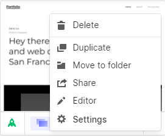

# Webflow Sync

This will sync two webflow instances

## Acquire a Webflow API Key

Instructions are [here](https://developers.webflow.com/oauth?shell#api-keys). 

To generate an API key for a site, open the site in the dashboard and navigate to the “Settings” pane. There is a section titled “API Access”, where you can generate a new API key.

Go to your workspace dashboard.

Click the settings tag 

Select the integration tab and there is a generate API token button

